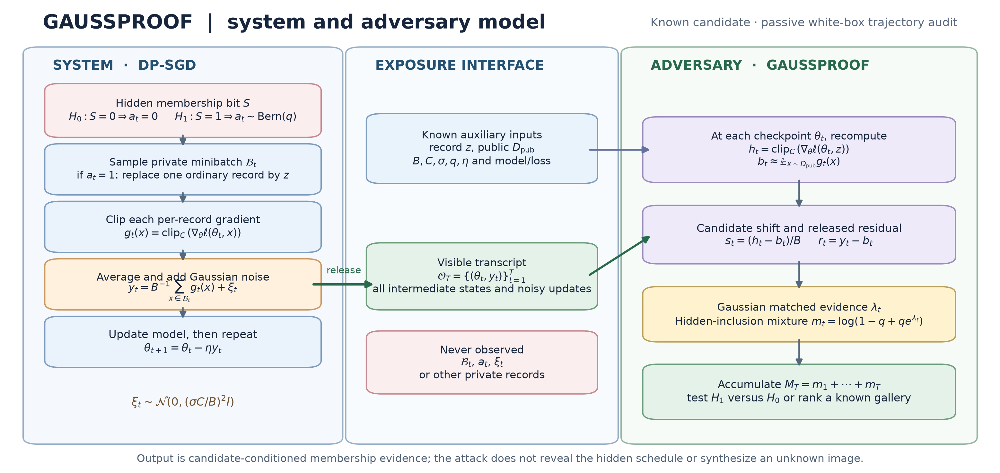

# GAUSSPROOF: system, adversary, and attack



The [vector figure](../paper/satml2027/figures/system_adversary_model.pdf) and its [rendering script](../scripts/make_system_adversary_model.py) are included for reuse in the paper.

## System and secret

At round `t`, a trainer has parameters `theta_t`, a private minibatch of size `B`, clipping threshold `C`, noise multiplier `sigma`, and learning rate `eta`. It releases the **noisy averaged gradient actually used for training**:

```text
g_t(x) = clip_C(grad_theta loss(theta_t, x))
y_t    = (1/B) sum_{x in batch_t} g_t(x) + xi_t
xi_t  ~ N(0, (sigma C/B)^2 I)
theta_{t+1} = theta_t - eta y_t.
```

The secret `S` concerns a specified, known candidate record `z`. Under `H0: S=0`, `z` is never in a private batch. Under `H1: S=1`, it replaces one ordinary record in each round independently with probability `q`; the realization `a_t` is hidden. This is the controlled canary protocol, **not** a claim that every ordinary record participates with that probability. The experiment must set `q` to match the population and sampling protocol of the intended deployment.

## Adversary and research question

The passive white-box observer knows `z` (or a finite gallery), the model and loss, `B`, `C`, `sigma`, `eta`, `q`, a disjoint public reference set, and the transcript of all intermediate checkpoints and noisy updates. For vanilla SGD with known learning rate, consecutive checkpoints also expose each update through `(theta_t-theta_{t+1})/eta`. The observer does not see private batches, the inclusion decisions, other private records, or the Gaussian draws.

The task is to test `H1` versus `H0` from this transcript, or rank a known gallery of possible records. **It is candidate-conditioned detection or record linkage.** It does not produce pixels for an unknown record. Its central question is whether a repeatedly observable, weak gradient fingerprint becomes detectable as the number of releases grows, conditional on a realistic participation rate and this strong observation interface.

## Gaussian-mixture approximation

At each *observed* checkpoint, recompute the candidate's clipped gradient `h_t = g_t(z)` and estimate an ordinary-record background `b_t = E_{x~D_pub}[g_t(x)]` from disjoint public data. Replacing one ordinary record with `z` shifts the average by

```text
s_t = (h_t - b_t)/B,       r_t = y_t - b_t,       v = (sigma C/B)^2.
```

The tractable approximation is `H0: y_t | theta_t ~ N(b_t,vI)` and `H1: y_t | theta_t ~ (1-q)N(b_t,vI) + qN(b_t+s_t,vI)`. For the present component, the Gaussian shift log-likelihood ratio is

```text
lambda_t = <s_t,r_t>/v - ||s_t||^2/(2v).
```

Marginalizing the hidden Bernoulli inclusion gives `m_t = log(1-q+q exp(lambda_t))`. The trajectory score is `M_T(z) = sum_{t=1}^T m_t`. This is an exact likelihood ratio **only for the stated conditional Gaussian mixture**. Actual minibatch variation, public-background error, and the dependence of `theta_t` on earlier private data make it an approximate attack score for evolving DP-SGD. The simpler `sum_t lambda_t` is a matched-score control. A same-access canary-gradient projection is an essential comparator; the Gaussian matched term is closely related to that established white-box primitive.

## Attack algorithm

```text
Input: observed {(theta_t,y_t)}_{t=1}^T; candidate z; public D_pub;
       B, C, sigma, q; decision threshold tau from disjoint calibration.
Set v = (sigma C/B)^2 and M = 0.
For t = 1,...,T:
    h = clip_C(grad_theta loss(theta_t,z))
    b = mean_{x in D_pub} clip_C(grad_theta loss(theta_t,x))
    s = (h-b)/B
    lambda = dot(s,y_t-b)/v - dot(s,s)/(2v)
    M += logaddexp(log(1-q), log(q)+lambda)  # q=1: add lambda
Return M and the decision 1[M > tau].
```

For a gallery, run the score for every known candidate against the **same** observed transcript and rank by `M_T`. The score can be accumulated online with constant scalar state per candidate; aside from gradient computation, the matched operations cost `O(Td)` per candidate or `O(TKd)` for `K` candidates in `d` observed coordinates.

At fixed exposure, increasing `sigma` weakens this signal. At fixed `sigma`, more releases can accumulate evidence when participation is frequent enough. Neither statement implies that increasing noise itself worsens privacy. The current ordinary-sampling proxy `q=0.004` was at chance within 128 rounds; the strong results belong to the frequent-participation canary regime.
