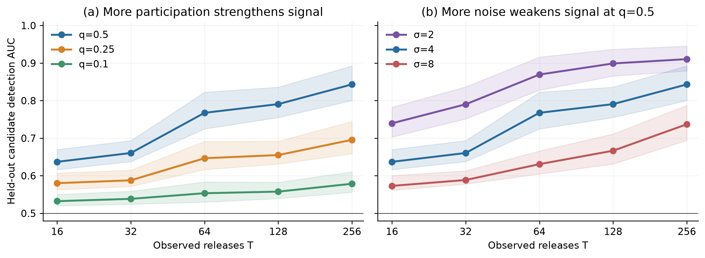

# Repeated-fingerprint signal on 80 new identities

This fixed-design replication tests whether frequent participation causes a
known candidate's weak gradient fingerprint to accumulate across noisy,
evolving DP-SGD updates. It uses the exact MNIST CNN simulator with clip norm
`C=1`, batch size `B=8`, noise multiplier `sigma=4`, learning rate `0.05`,
and nested prefixes of `T={16,32,64,128,256}`. The candidate is eligible at
each round with hidden Bernoulli probability `q={0.5,0.25,0.1}`. No private
inclusion indicator or sampled Gaussian noise is given to the score.

Eighty stratified natural candidate identities (eight per digit) are disjoint
from the 20-identity exploratory pilot and from the four original canaries.
Each identity has two paired IN/OUT runs for each q, giving 960 full
trajectories. Seeds couple the positive and negative conditions and make
lower-q inclusion schedules subsets of higher-q schedules. The trajectory
score is the checkpoint-specific, background-subtracted Gaussian-mixture LLR.

| q | AUC at T=16 | AUC at T=256 (95% identity-bootstrap interval) | Paired gain, 256 minus 16 (95% interval) |
| ---: | ---: | ---: | ---: |
| 0.5 | 0.633 | 0.843 [0.808, 0.884] | +0.210 [0.165, 0.250] |
| 0.25 | 0.572 | 0.696 [0.665, 0.734] | +0.124 [0.087, 0.163] |
| 0.1 | 0.530 | 0.589 [0.568, 0.618] | +0.059 [0.036, 0.084] |

The q ordering at T=256 is also resolved under the same paired bootstrap:
q=0.5 minus q=0.25 is +0.147 [0.127, 0.165], and q=0.25 minus q=0.1
is +0.107 [0.085, 0.130]. Thus this experiment supports increasing
detectability with **more releases and more frequent participation** at fixed
noise. The q=0.1 signal remains weak despite 256 releases.

## Noise check on matched identities

At q=0.5, separate exact evolving runs used sigma 2 and 8 with the same
80 identities, initial model, and seed. For a fully paired comparison, the
sigma=4 arm was restricted to sequence index zero, matching the single
sequence per identity in the new arms. All curves in the figure below use
this same one-sequence subset; the main table above uses both sigma=4
sequences.

| Noise multiplier sigma | AUC at T=16 | AUC at T=256 (95% identity-bootstrap interval) |
| ---: | ---: | ---: |
| 2 | 0.740 | 0.910 [0.879, 0.945] |
| 4 | 0.637 | 0.843 [0.800, 0.892] |
| 8 | 0.573 | 0.737 [0.694, 0.787] |

At T=256, the paired AUC difference sigma 2 minus 4 is +0.067
[0.033, 0.102], and sigma 4 minus 8 is +0.106 [0.039, 0.169]. Thus
more noise **reduces** detection at fixed q and T, while the sigma=8
trajectory still accumulates detectable evidence in this frequent-
participation regime. This is consistent with the approximate
q*sqrt(T)/sigma signal scale, without claiming that it is an exact model
of the evolving CNN and minibatch background.

The [vector figure](fingerprint_signal.pdf), [matched participation AUCs](participation_auc_matched.csv),
[matched noise AUCs](noise_auc.csv), and [paired noise contrasts](noise_contrasts.csv)
support the displayed curves. The two noise-run completion manifests are
[sigma 2](completion_sigma2.json) and [sigma 8](completion_sigma8.json).

The final-model candidate-loss control reaches AUC 0.735, 0.626, and 0.548 at
T=256 for the three q values. This short-run learning-rate setting has poor
final-model utility in the earlier replication; these numbers are an access
control, not evidence of superiority over a strong, useful-model endpoint
attack. Likewise, the score's gain over an equal-access raw projection is not
tested here and was not established in the earlier useful-model comparison.

Low-FPR usability is not yet established. An independent threshold calibrated
to nominal 5% FPR on the 20 negative pilot identities gives, at T=256,
holdout TPR/FPR of 57.5%/11.25% for q=0.5, 30.0%/10.0% for q=0.25,
and 21.9%/11.9% for q=0.1. Because the **achieved FPR exceeds 5%**, none
of these TPRs is a validated TPR-at-5%-FPR result. The tiny calibration set
has 5-percentage-point FPR resolution; a larger, disjoint calibration set
or a more conservative threshold is needed before making a low-FPR claim.
All prefixes and realized rates are in [calibrated_low_fpr.csv](calibrated_low_fpr.csv).

This is a deliberately high-participation regime: expected candidate
inclusions at T=256 are 128, 64, and 25.6. It does not describe an ordinary
record with q approximately 0.004. It does not show that increasing noise
backfires, unknown-image reconstruction, or a formal empirical DP lower
bound. The conservative replace-one, no-amplification upper bound at
sigma=4 and T=256 is epsilon 70.39 for delta 1e-5; this is not a
small-epsilon training guarantee.

The [full-prefix AUCs](summary.csv), [paired contrasts](paired_contrasts.csv),
[inclusion diagnostics](inclusion_summary.csv), [endpoint comparisons](trajectory_vs_endpoint.csv),
and [completion manifest](completion.json) are committed. Raw identity-level
rows remain under ignored `runs/`. The two q arms completed before an
interrupted interactive turn were validated as complete grids and reused;
the q=0.1 arm was then run with the same config and seed using `--resume`.
The first two arms used code at commit `759e00f`; the later code change added
resume validation and left trajectory generation and scoring unchanged. The
completion manifest's `seconds` field covers the resumed invocation, not
the wall time of all three arms.
The reproducible parameters are in
`configs/canary_first_principles_holdout.json`.
