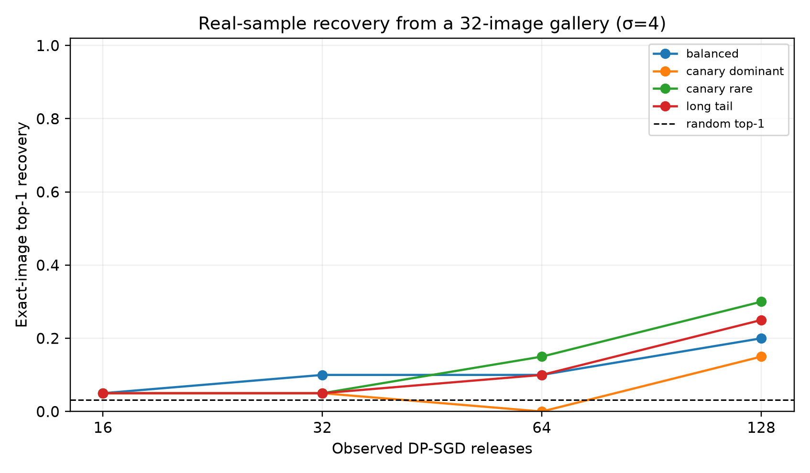
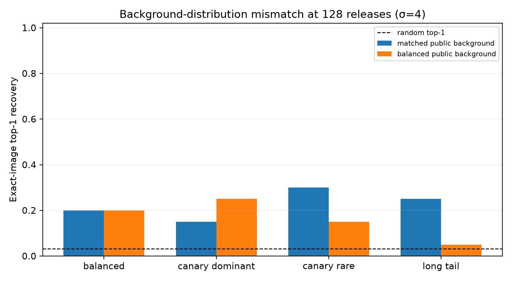
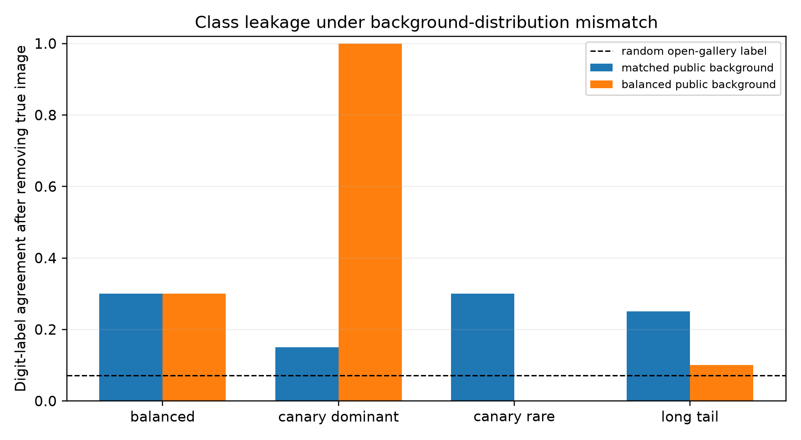

# Real-canary recovery across training distributions

This experiment turns accumulated trajectory evidence into exact recovery of a
real held-out MNIST record from a 32-image auxiliary gallery. The target is one
of ten possible canaries, one per digit. Each canary is an ordinary unmodified
MNIST test image, disjoint from public pretraining, public background data and
the private population.

The attack observes exact evolving white-box CNN states and 128 DP-SGD gradient
releases with `sigma=4`, `C=1`, batch size 8 and a 0.5 per-round canary inclusion
probability. It computes every gallery candidate's current fingerprint and
accumulates a Bernoulli-mixture Gaussian likelihood score. There are two paired
trajectories for each of ten identities in every distribution.

## Matched-background results at 128 releases

| private distribution | exact top-1 | exact top-5 | predicted digit | same-class top-1 | open-gallery digit | open pixel MSE |
|---|---:|---:|---:|---:|---:|---:|
| balanced | 20% | 65% | 45% | 45% | 30% | 0.140 |
| long tail | 25% | 60% | 40% | 60% | 25% | 0.138 |
| canary class rare | 30% | 55% | 40% | 60% | 30% | 0.124 |
| canary class dominant | 15% | 50% | 25% | 30% | 15% | 0.149 |
| random baseline | 3.1% | 15.6% | — | 31.7%* | 7.1% | 0.147 |

`*` The 31.7% comparator is an oracle that knows the correct digit and chooses
randomly among same-digit gallery candidates. It is the relevant class-only
baseline for the same-class metric.

The correct real image is recovered far above the 3.1% random top-1 rate in all
four matched distributions. Long-tail and rare-canary settings reach 60%
same-class top-1, compared with the 31.7% class-only baseline. This is evidence
of sample-specific fingerprint information beyond merely recognizing the digit,
although the pilot has only ten identities and its intervals are wide.

## Distribution mismatch exposes a confound

A balanced public background reduces exact top-1 at 128 releases from 25% to 5%
for long-tail data and from 30% to 15% when the canary class is rare. Background
modeling therefore matters to the individual-record score.

The canary-dominant mismatch is especially revealing. A balanced background
produces 100% digit agreement and 100% open-gallery digit agreement, but only
25% same-class top-1, which is at or below the 31.7% class-only baseline. The
observer detects that the private gradients are dominated by one class and then
guesses within that class. Its superficially strong top-5 and digit metrics are
not evidence of individual reconstruction.

## What the canary demonstrates

Canary detection supplies controlled ground truth for membership and
re-identification. If the observer ranks the exact canary first, it has linked a
known sensitive record to the released training trajectory. That is a concrete
privacy failure in a candidate-list threat model: for example, an attacker who
already possesses a finite set of suspected patient records can infer which one
participated.

This result is **closed-gallery record recovery**, not reconstruction of an
unknown image. When the true image is removed, matched-background label
agreement is 15–30%, but the chosen image is only another gallery record and
pixel MSE improves inconsistently over the 0.147 random baseline. The experiment
therefore does not establish free-form image reconstruction.

The result also does not show that raising `sigma` at fixed composition makes
DP weaker. It shows that a large per-round noise level does not by itself erase
a recurring fingerprint. The conservative privacy upper bound for the related
128-release audit is `epsilon=43.14` at `delta=1e-5`, so this is a weak-privacy
regime. The defensible message is that repeated releases, trajectory length and
distribution assumptions must be included in the audit.

See the [full protocol](../../docs/canary_gallery_protocol.md),
[summary data](summary.csv), [baselines](baselines.csv), and
[class probabilities](class_probabilities.csv). Row-level retrievals and MNIST
pixels remain in the local run directory.

