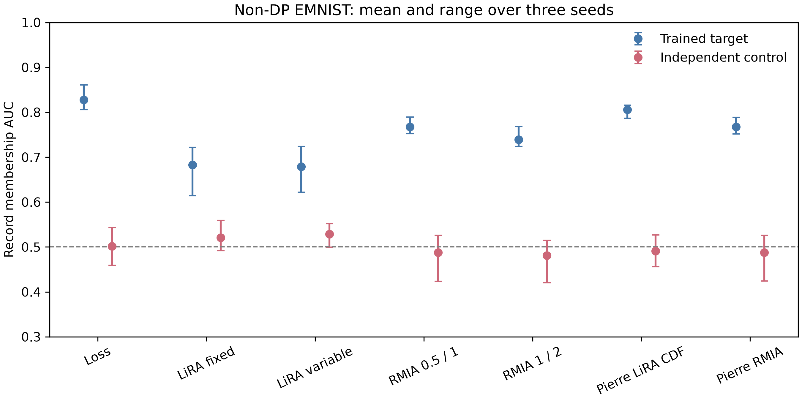

# LiRA and RMIA non-DP positive control

Both attacks detect actual training-record membership in a real, non-DP
EMNIST experiment. This is a validation of the attack implementations and
score orientation **before** interpreting the DP-FTRLM pilot; it is not a
high-noise leakage claim.

The target and eight OUT reference models are identical two-hidden-layer
(128-unit) MLPs trained for 500 full-batch Adam epochs on 28×28 foreground
pixels, without clipping or DP noise. Each model has 120 training records (12
per digit). The target's 120 member candidates, 120 nonmember candidates, 240
population records, 120 independent-control training records, and each
reference model's 120 training records come from **disjoint EMNIST writers**.
Only one record is selected per writer. The references and population are OUT
for every attacked candidate. All attacks score the same 240 candidates.
An independent model trained on another disjoint 120 records provides a
control: neither candidate class belongs to its training set. The three
fixed split/training seeds are `20260929`, `20261001`, and `20261003`.
The target fit all its members in each seed (100% training accuracy); accuracy
on nonmembers was 60.8–72.5%.

| Score | Target AUC mean [seed range] | Independent-control AUC mean [seed range] |
|:--|--:|--:|
| True-label loss | 0.828 [0.806, 0.861] | 0.501 [0.459, 0.543] |
| Original offline LiRA, fixed variance | 0.683 [0.614, 0.722] | 0.521 [0.492, 0.559] |
| Original offline LiRA, variable variance | 0.679 [0.622, 0.724] | 0.529 [0.500, 0.552] |
| Original offline RMIA, a=0.5, γ=1 | 0.768 [0.752, 0.789] | 0.488 [0.423, 0.526] |
| Original offline RMIA, a=1, γ=2 | 0.739 [0.724, 0.768] | 0.481 [0.420, 0.515] |
| Pierre-Joly offline LiRA CDF | 0.806 [0.786, 0.816] | 0.491 [0.456, 0.527] |
| Pierre-Joly offline RMIA, a=0.5, γ=1 | 0.767 [0.752, 0.789] | 0.488 [0.424, 0.526] |

These are independent-seed **ranges**, not confidence intervals. Each
individual seed's CSV also reports candidate-resampling bootstrap intervals.
The original LiRA score is a negative OUT Gaussian log-density on the scaled
true-label logit, as in the [original LiRA scoring code](https://github.com/tensorflow/privacy/blob/master/research/mi_lira_2021/score.py)
and [offline attack code](https://github.com/tensorflow/privacy/blob/master/research/mi_lira_2021/plot.py).
The Pierre-Joly LiRA variant instead scores the OUT Gaussian CDF of the raw
correct-class logit. They are different attacks and are not pooled. Likewise,
the original [RMIA paper](https://proceedings.mlr.press/v235/zarifzadeh24a.html)
uses the corrected population denominator; the Pierre-Joly implementation
does not, so both are labeled explicitly.

The downloaded
[Pierre-Joly source at commit `9182ed8`](https://github.com/Pierre-Joly/Membership-Inference-Attacks/tree/9182ed809d9fa3d5141d50816b7e83a06590371b)
was checked against pinned SHA-256 hashes. Its actual `OfflineRMIA` and
`OfflineLiRA` classes ran on the trained EMNIST models for **each of the three
seeds**, and their record scores matched our corresponding score functions.
The source repository does not provide the training artifacts referenced by
its default config, so this parity check uses our independently trained
models and injects their data loaders into the original attack classes.
Original-paper LiRA and RMIA formula checks also run in the local unit tests.

The first exploratory 7×7-pooled target fit only 71.7% of its training
records; a second full-resolution attempt using uncentered white-background
pixels collapsed to chance. Those were training failures, so the validated
protocol uses full-resolution **foreground** intensities and requires at
least 95% target training accuracy. The final three seeds all satisfied that
check. This deliberately overfitted, record-level positive control establishes
that the baseline implementations can detect membership. It does not show
that they retain power after DP-FTRLM noise or after aggregation to clients.

Run the validator from the repository root with the federated EMNIST digits
SQLite file described in
[the experiment README](../../experiments/dp_ftrl_independent/README.md)
and a checkout of the pinned Pierre-Joly source. Python requires PyTorch,
NumPy, SciPy, Matplotlib, `msgpack`, `tqdm`, and `python-dotenv`.

```bash
python -m unittest discover -s experiments/dp_ftrl_independent -p 'test_*.py' -q
for seed in 20260929 20261001 20261003; do
  OPENBLAS_NUM_THREADS=1 OMP_NUM_THREADS=1 \
  python experiments/dp_ftrl_independent/validate_nodp_mia.py \
    --sqlite /path/to/federated_emnist_digitsonly_train.sqlite \
    --output "reports/no_dp_mia_validation/stable_seed_${seed}" \
    --seed "$seed" --pierre-source /path/to/Membership-Inference-Attacks
done
python experiments/dp_ftrl_independent/summarize_nodp_mia.py \
  --root reports/no_dp_mia_validation \
  --output reports/no_dp_mia_validation/aggregate
```

The validator refuses to overwrite nonempty output directories. Published
artifacts contain aggregate metrics, settings, data digest, and PDF/PNG plots;
they do not contain images, writer IDs, individual record scores, or models.


