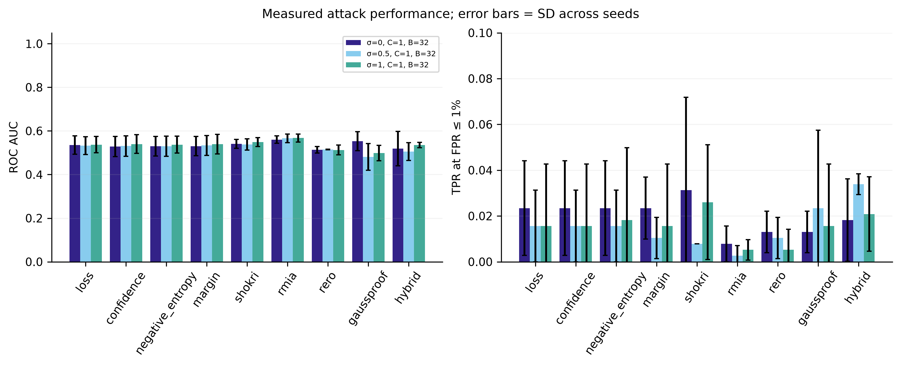
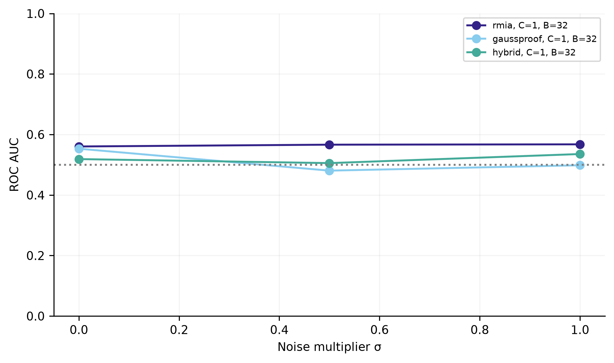

# Measured benchmark report

Completed 9 target conditions with 3 seeds; 81 attack/condition measurements.
Held-out classification accuracy ranged from 73.4% to 85.9%.
Each condition uses 128 evaluation members and 128 nonmembers; FPR resolution is 0.781%.

These are measured results, including negative findings. A small sample pilot does not establish superiority at low FPR.
Different access assumptions apply to black-box, gradient and hybrid attacks. All metrics use the same target/candidates within a condition.

| σ | C | B | Attack | AUC mean ± seed SD | TPR@1% mean |
| --- | --- | --- | --- | --- | --- |
| 0 | 1 | 32 | confidence | 0.529 ± 0.046 | 0.023 |
| 0 | 1 | 32 | gaussproof | 0.553 ± 0.043 | 0.013 |
| 0 | 1 | 32 | hybrid | 0.519 ± 0.079 | 0.018 |
| 0 | 1 | 32 | loss | 0.535 ± 0.042 | 0.023 |
| 0 | 1 | 32 | margin | 0.530 ± 0.044 | 0.023 |
| 0 | 1 | 32 | negative_entropy | 0.530 ± 0.045 | 0.023 |
| 0 | 1 | 32 | rero | 0.513 ± 0.014 | 0.013 |
| 0 | 1 | 32 | rmia | 0.560 ± 0.017 | 0.008 |
| 0 | 1 | 32 | shokri | 0.541 ± 0.021 | 0.031 |
| 0.5 | 1 | 32 | confidence | 0.531 ± 0.047 | 0.016 |
| 0.5 | 1 | 32 | gaussproof | 0.481 ± 0.061 | 0.023 |
| 0.5 | 1 | 32 | hybrid | 0.505 ± 0.040 | 0.034 |
| 0.5 | 1 | 32 | loss | 0.532 ± 0.041 | 0.016 |
| 0.5 | 1 | 32 | margin | 0.533 ± 0.045 | 0.010 |
| 0.5 | 1 | 32 | negative_entropy | 0.530 ± 0.046 | 0.016 |
| 0.5 | 1 | 32 | rero | 0.515 ± 0.002 | 0.010 |
| 0.5 | 1 | 32 | rmia | 0.566 ± 0.020 | 0.003 |
| 0.5 | 1 | 32 | shokri | 0.538 ± 0.026 | 0.008 |
| 1 | 1 | 32 | confidence | 0.540 ± 0.043 | 0.016 |
| 1 | 1 | 32 | gaussproof | 0.498 ± 0.036 | 0.016 |
| 1 | 1 | 32 | hybrid | 0.535 ± 0.012 | 0.021 |
| 1 | 1 | 32 | loss | 0.537 ± 0.038 | 0.016 |
| 1 | 1 | 32 | margin | 0.539 ± 0.045 | 0.016 |
| 1 | 1 | 32 | negative_entropy | 0.537 ± 0.039 | 0.018 |
| 1 | 1 | 32 | rero | 0.513 ± 0.022 | 0.005 |
| 1 | 1 | 32 | rmia | 0.567 ± 0.018 | 0.005 |
| 1 | 1 | 32 | shokri | 0.549 ± 0.021 | 0.026 |

See `summary.csv`, `metrics.csv`, `utility.csv`, and validation tables for the complete measured results.
Only aggregate statistics and figures are exported. Raw sample scores, split IDs, checkpoints and trajectories remain local.
The SHA256 manifest below covers the exported files, not the raw local run.
